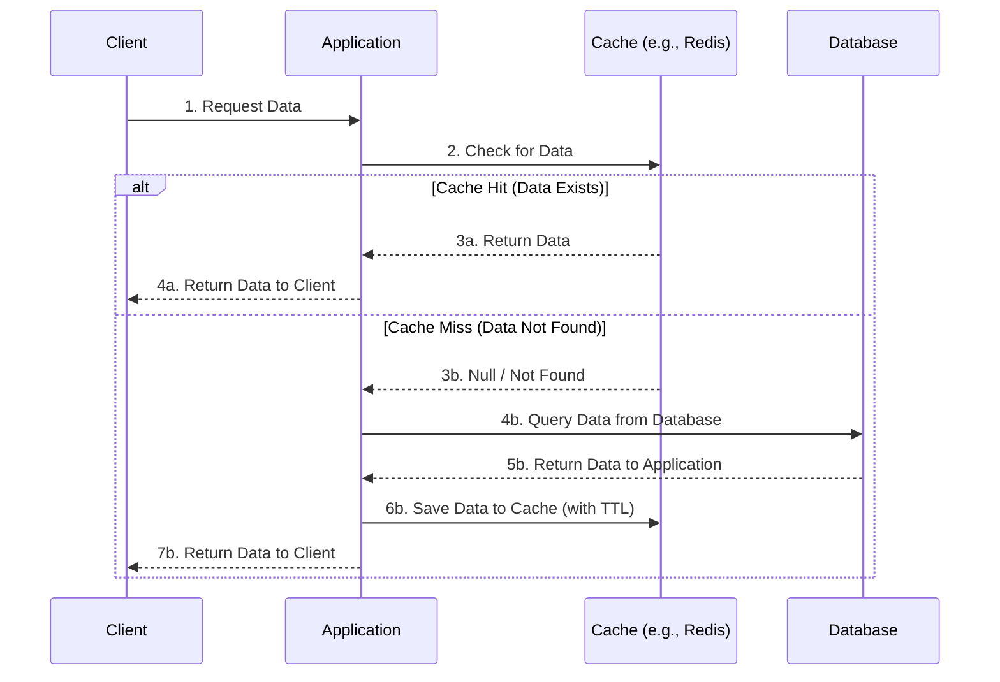

# Cache-Aside (Lazy Loading) Pattern

The Cache-Aside pattern is a caching strategy where the application is directly responsible for managing both the cache and the database. The cache does not interact with the database directly; instead, it sits "aside" the application.
The application first checks the cache for the requested data. If it exists (Cache Hit), it returns it. If not (Cache Miss), it fetches the data from the database, writes it to the cache for future requests, and then returns it to the user.

## How It Works

1. **Request:** The application checks the **Cache** for data.
2. **Cache Hit:** If found, the data is returned immediately.
3. **Cache Miss:** If NOT found, the application queries the **Database**.
4. **Update Cache:** The application writes the fetched data into the **Cache** (usually with a TTL).
5. **Response:** The application returns the data to the user.

---

### Pros (Advantages)
* **System Resilience:** If the cache fails, the app still functions by querying the database directly (performance degrades, but the system stays online).
* **Memory Efficiency:** Only requested data is cached, preventing expensive memory from filling up with "cold" (unused) data.
* **Data Flexibility:** You can aggregate multiple DB tables into a single cached object, independent of the DB schema.
* **Granular Control:** Developers can set different expiration (TTL) strategies for different types of data.

---

### Cons (Disadvantages)
* **Latency on Cache Miss:** The first request is slower because it requires three steps: *Check Cache ➔ Read DB ➔ Write Cache*.
* **Stale Data:** The cache can hold outdated data if the database is updated by another process before the cache expires.
* **Code Complexity:** The application layer must handle all logic for checking, reading, and writing to both systems.

---

### When to Use
* **Read-Heavy Workloads:** Data is read much more often than it is updated (e.g., User Profiles, Product Catalogs).
* **Unpredictable Access Patterns:** When you cannot predict which data users will request, making pre-loading impractical.
* **Aggregated Data:** When a response requires heavy computation or joining multiple tables.
* **Eventual Consistency:** When your application can tolerate data being slightly out-of-date for a short period.
