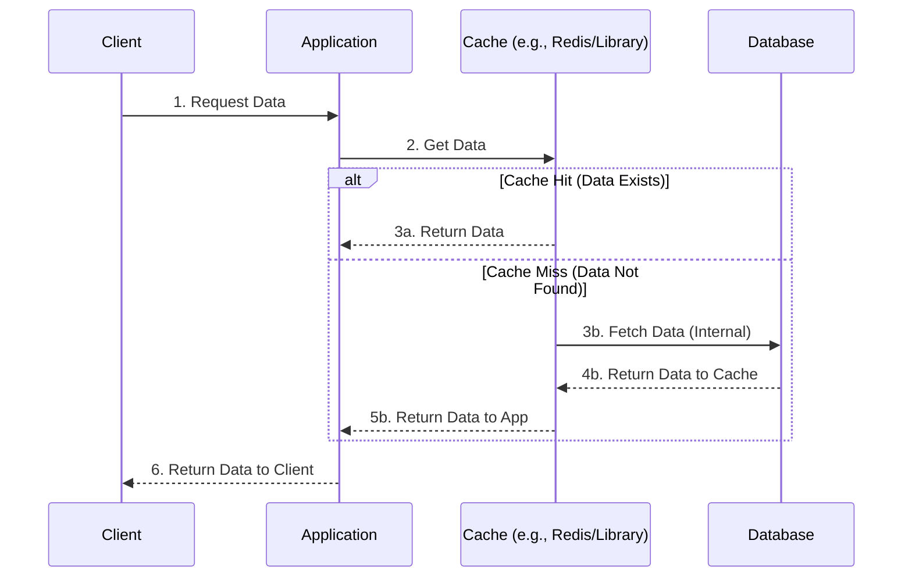

# Read-Through Caching Pattern

In the Read-Through pattern, the application treats the Cache as the main data store. The application code never queries the database directly for reads. Instead, the cache library or provider is responsible for fetching data from the database when a miss occurs.

## Execution Flow

Unlike Cache-Aside, **the Cache (not the App) handles the database interaction**.

---

## Pros (Advantages)

- **Simplified App Code:** The application logic is cleaner because it only talks to the cache. It doesn't need to handle database query logic or cache population.
- **Read Scalability:** High read performance. Once data is in the cache, the database is completely shielded from traffic.
- **Separation of Concerns:** Data fetching logic is moved out of the application and into a dedicated caching layer or library.

---

## Cons (Disadvantages)

- **Initial Latency:** Similar to Cache-Aside, the first request results in a "Cache Miss" penalty (Cache ➔ DB ➔ Cache ➔ App).
- **Infrastructure Complexity:** Requires a cache provider or library that supports "Read-Through" logic (e.g., specific plugins or custom handlers).
- **Data Inconsistency:** If the database is updated directly by another process, the cache becomes stale until the TTL expires.

## When to Use
- **Read-Heavy Workloads**: Where the same data is requested repeatedly (e.g., Configuration settings, User permissions).
- **Code Cleanliness:** When you want to keep your application code simple and avoid "if-cache-miss-then-db" logic everywhere.
- **Unified Data Access:** When you want to provide a single interface (the Cache) for all data retrieval.
