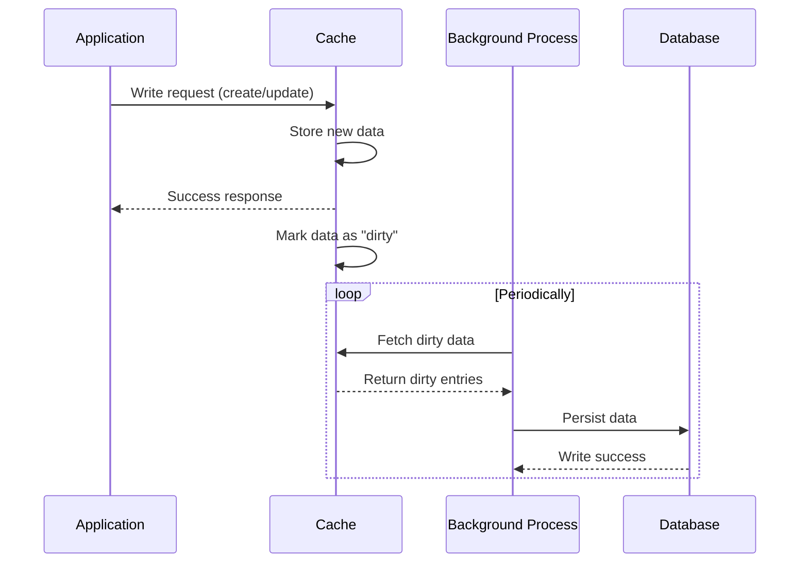

# Write Back / Write behind Pattern

## How It Works

1. The application sends a write request (create or update) to the caching system.
2. The cache stores the new data.
3. The cache immediately returns a success response to the application.
4. The cache marks this data as "dirty" (meaning it has been modified but not yet saved to the database).
5. A background process (a timer, an event loop, or a queue worker) periodically collects the "dirty" data and writes it to the underlying database.

## Advantages
- Extremely High Write Performance: The application does not have to wait for the slow database write operation. It only waits for the fast memory-level cache write.
- Reduced Database Load (Write Coalescing): If an application updates the same record 100 times in 10 seconds, the cache will only perform one write to the database (the final state) when the background flush occurs.
- Batching: The background process can group multiple individual writes into a single bulk insert/update operation, massively improving database efficiency.
- Resilience to Database Outages: If the primary database goes down temporarily, the application can continue to accept writes (as long as the cache has memory), syncing them later when the database recovers.

## Disadvantages
- Risk of Data Loss: If the cache server crashes or loses power before the background process has synced the "dirty" data to the database, that data is permanently lost.
- Implementation Complexity: Handling database write failures in the background is difficult. If a background write fails (e.g., due to a constraint violation), the application has already been told the write was successful.
- Eventual Consistency: If another system reads directly from the database, it will see stale data until the cache flushes its updates.

## When to Use It
- The Write-Behind pattern is ideal for write-heavy workloads where absolute data durability is less critical than extreme performance and throughput.
- Analytics and Telemetry: Storing IoT sensor data, clickstreams, or log events.
- Counters: YouTube video views, social media "likes," or real-time gaming scores.
- User Sessions: Updating user session data or shopping cart states.
