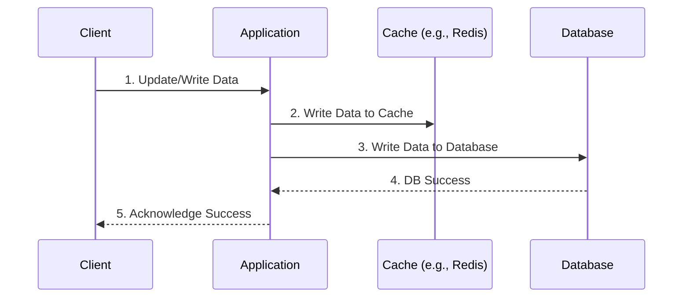
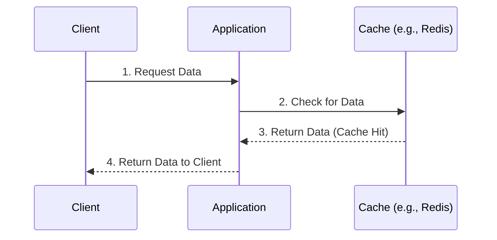

# Write-Through Caching Pattern

In the **Write-Through** pattern, the application treats the cache as the primary data store. When data is updated, the application writes to **both** the cache and the database simultaneously. This ensures the cache is always a mirror of the database.

---

### How It Works
#### **Write Operation (The Core Logic):**
1. **Application Write:** The application receives new or updated data.
2. **Update Cache:** The data is written to the **Cache** immediately.
3. **Update Database:** The data is written to the **Database** in the same transaction or flow.
4. **Confirmation:** The application confirms success only after *both* are updated.

**Write flow**

**Read flow**

#### **Read Operation:**
1. **Request:** The application checks the **Cache**.
2. **Cache Hit:** Because data is cached during the "Write" phase, the hit rate is extremely high.
3. **Response:** Data is returned instantly.

---

###  Pros (Advantages)
*   **Data Consistency:** The cache is never "stale" (outdated) because it is updated the moment the database changes.
*   **High Read Performance:** Since data is pre-loaded into the cache during the write, users rarely experience a "Cache Miss" penalty.
*   **No Stale Data:** You don't have to worry about complex TTL or invalidation logic as much as you do with Cache-Aside.

---

###  Cons (Disadvantages)
*   **Write Latency:** Writing to two systems (Cache + DB) takes longer than writing to one. The user must wait for both network trips to finish.
*   **Cache Churn/Waste:** Every piece of data is cached, even if it is never read. This can waste expensive cache memory on "cold" data.
*   **Write Failure Risk:** If the database write fails but the cache write succeeds (or vice versa), the two systems become inconsistent unless handled by complex transaction logic.

---

### When to Use
*   **Data Consistency is Critical:** When you cannot afford to show users old data (e.g., banking balances, inventory levels).
*   **Read-Heavy with Frequent Updates:** When data changes often, but you still need the fastest possible read speeds immediately after an update.
*   **Low Tolerance for Stale Data:** When implementing a TTL (Time-To-Live) is not precise enough for your business needs.

---

> **💡 Pro-Tip:** Write-Through is often paired with an **Eviction Policy** (like Least Recently Used - LRU) to ensure that the cache doesn't grow indefinitely since it caches *everything* written to the DB.
